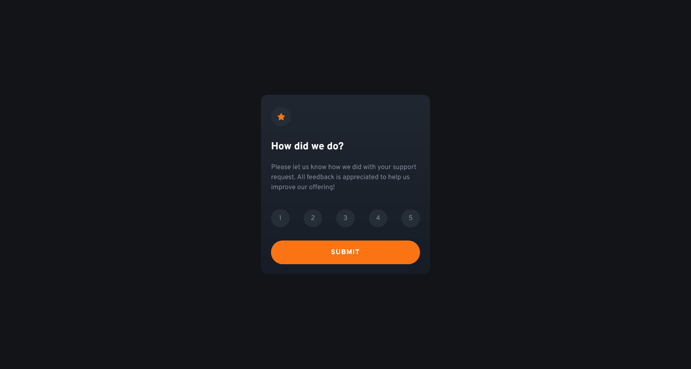

# Frontend Mentor - Interactive Rating Component Solution

This is a solution to the [Interactive Rating Component Challenge on Frontend Mentor](https://www.frontendmentor.io/challenges/interactive-rating-component-koxpeBUmI). Frontend Mentor challenges help you improve your coding skills by building realistic projects. 

## Table of contents

- [Overview](#overview)
  - [The challenge](#the-challenge)
  - [Screenshot](#screenshot)
  - [Links](#links)
- [My process](#my-process)
  - [Built with](#built-with)
  - [What I learned](#what-i-learned)
  - [Continued development](#continued-development)
  - [Useful resources](#useful-resources)

## Overview

### The challenge

Users should be able to:

- View the optimal layout for the app depending on their device's screen size
- See hover states for all interactive elements on the page
- Select and submit a number rating
- See the "Thank you" card state after submitting a rating

### Screenshot

### Links

- [Solution](https://github.com/VasJM/interactive-rating-component)
- [Live Site](https://adorable-frangollo-599bd3.netlify.app/)

## My process

### Built with

- Love 💖
- Semantic HTML5 markup
- CSS custom properties
- CSS Grid
- Mobile-first workflow

### What I learned

Taking breaks is **VERY** important. But other than that, CSS Grid is super handy! This project was easy, with only a few hiccups because I'm Jared 19 and I never learned how to read 🤙

### Continued development

SVGs. Work more with SVGs. Definitely.

### Useful resources

[MDN Docs](https://developer.mozilla.org/en-US/) my most beloved, I would be so lost without her 💖